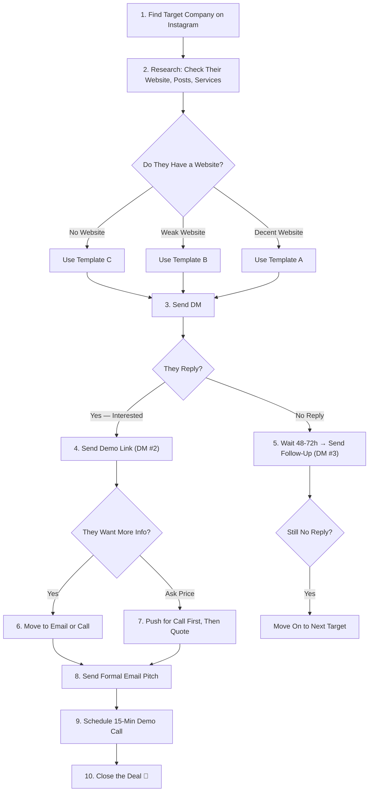

# 🚀 Client Outreach Playbook — @bgr.dev
## Selling Your Premium Solar Panel Website

---

## 📋 What You're Selling (Your Sell Sheet)

Before reaching out, you need to know **exactly** what you built and how to frame it. Here's your ammunition:

### The Product
A **premium, fully-designed solar & home services website + complete admin panel** — front-end complete with 15+ pages, 10 homepage sections, dedicated service pages, client portal, and a full CMS-powered admin dashboard. Back-end ready to plug in.

> [!TIP]
> The **admin panel is your secret weapon**. Most freelancers only deliver a public website. You're delivering a public website AND a full business management dashboard. That's 2x the value, and it's what separates a $500 project from a $3,000+ project.

### Key Features to Highlight

#### 🌐 Public Website (15+ Pages)
| Feature | Why the Client Cares |
|---|---|
| **Homepage (10 sections)** — Hero with CTA & status pill, Core Services showcase, The Process, Feature Cards, Roof Engineering, Smart Monitoring iPhone mockup, Cybertruck Fleet gallery, Testimonials grid, Grid Independence, FAQ accordion | One page covers their entire value proposition with 10 custom sections |
| **Solar Page** — Tax credit urgency hero, benefits cards, hardware showcase (Q Cells, Enphase), zig-zag content, past work gallery, warranty badge, CTA | Dedicated landing page that sells solar and converts leads |
| **Roofing Page** — Full hero, Owens Corning partnership, installation walkthrough, hail damage section with CTA | Shows expertise and drives roofing-specific leads |
| **Windows & Doors Page** — Seasonal sale hero, Pella partnership, full Pella Series showcase (250, Lifestyle, Impervia), benefits cards, image CTA | Premium presentation for window services |
| **Hail Damage Page** — Split-layout with numbered steps, integrated lead capture form, background image | Seasonal landing page that captures emergency leads |
| **Pella Certified Installers** — Hero + embedded consultation form, dual branding, full-width Pella banner, sustainability section | Leverages partnership credibility to close window deals |
| **Cybertruck Fleet Page** — Full gallery with 5+ images, lightbox zoom, fleet description, Instagram callout | Showcases brand personality and forward-thinking identity |
| **Estimate Page** — Premium split-layout quote form with service selection, property details, monthly bill input | Turns interested visitors into qualified leads |
| **Request Status Tracker** — Client portal with ID lookup, live progress timeline, schedule & pricing display | Clients can track their project status — reduces support calls |
| **Services Overview** — 6 core service cards, process timeline, impact stats, advantage badges | Educates customers and builds trust before they even call |
| **About Page** — Company story, mission, "By the Numbers" stat cards | Builds credibility and human connection |
| **Contact Page** — Full lead capture form + Contact Modal | Multiple ways for leads to reach them = more business |
| **FAQ Page** — Expandable accordion | Reduces support calls by answering common questions |
| **Gallery Page** — Project showcase | Social proof — shows real work to close skeptical buyers |
| **Auth Page** — Login / Signup with premium design | Professional entry point for the admin system |

#### 🖥️ Admin Dashboard (8 Full Pages — See Deep Dive Below)
| Feature | Why the Client Cares |
|---|---|
| **Dashboard** — KPI stat cards with mini charts, recent requests table, today's schedule, quick actions | See their entire business at a glance every morning |
| **Analytics** — Area charts, bar charts, pie charts, KPIs, regional performance | Data-driven decisions without hiring an analyst |
| **Requests & Leads** — Filterable table, accept/reject, schedule modal with technician assignment | Manage incoming leads like a CRM |
| **Installation Calendar** — Month/Week/Day views, color-coded events, upcoming sidebar | Never miss an appointment or double-book a crew |
| **Pages Manager** — Edit ALL website pages (Home, About, Services) with live preview panel | Change any page's content themselves — no developer needed. Full CMS control. |
| **FAQ Manager** — Add/edit/delete FAQs | Keep their FAQ page updated without calling you |
| **Contact Manager** — Manage contact information | Update phone, email, address on the fly |
| **Settings** — Profile, Security, Notifications, General tabs | Full account management |

#### ✨ Design & Technical
| Feature | Why the Client Cares |
|---|---|
| **Premium Dark-Mode Design** with glassmorphism, glow effects, Michroma typography | Looks 10x more premium than their competitors' basic sites |
| **Smart Monitoring Phone Mockup** (realistic iPhone with battery ring, live generation, solar panel SVG) | Shows their customers the tech lifestyle — sells the dream |
| **Fully Responsive** (Desktop, Tablet, Mobile) | Works perfectly on every device their customers use |
| **Framer Motion animations** throughout admin panel | Feels premium and alive, not like a static template |
| **Recharts data visualizations** (area, bar, pie charts) | Professional analytics that rival SaaS products |
| **Built with React** (modern, scalable) | Future-proof — easy to add features, integrate APIs, connect CRM |

---

## 🖥️ Admin Panel Deep Dive (Your Biggest Selling Point)

> [!IMPORTANT]
> **This is what closes deals.** Any developer can build a pretty homepage. Very few freelancers deliver a full admin panel with charts, calendars, request management, and content editors. When you show the admin panel, you're showing them a **business tool**, not just a website.

Here's exactly what's in the admin panel and how to talk about each page:

### 1. Dashboard (`/admin/dashboard`)
**What it has:** 4 KPI stat cards (Total Requests, Pending, Installations, Revenue) each with mini sparkline area charts and trend indicators. Recent Requests table with client name, service, date, and status badges. Today's Schedule sidebar with color-coded time blocks. Quick Actions grid (Schedule, Edit Home, Add FAQ, Contacts).

**How to sell it:**
> "Every morning you open this and in 5 seconds you know exactly how your business is doing — how many leads came in, what's pending, revenue trends, and what's on the schedule today."

### 2. Analytics (`/admin/analytics`)
**What it has:** 4 KPI cards (Conversion Rate, Avg Revenue, Completion Time, Active Clients). Full-width area chart showing Requests vs Installations over 10 months. Bar chart breaking down services by project count and revenue. Donut/pie chart showing client sources (Website, Referral, Social, Direct). Regional performance progress bars.

**How to sell it:**
> "This is like having a business intelligence analyst on your team. You can see which services make the most money, where your clients come from, and which regions are performing best — all in real-time."

### 3. Requests & Leads (`/admin/requests`)
**What it has:** Filter tabs (All, Pending, Accepted, Completed, Rejected) with live counts. Full data table with Request ID, Client name + email, Service type, Preferred date, Request date, Status badge. Action buttons: View, Accept (green), Reject (red). Accept triggers a **Schedule Installation modal** with client details card, technician assignment dropdown, date/time pickers, and notes textarea.

**How to sell it:**
> "Every lead that comes through your website lands here. You see their info, what they need, and you can accept and schedule the install — all from one screen. No more sticky notes or spreadsheets."

### 4. Installation Calendar (`/admin/calendar`)
**What it has:** Month/Week/Day view toggle. Full calendar grid with color-coded events (Installation=purple, Site Survey=green, Large Install=blue, Maintenance=yellow, Battery Setup=violet, Consultation=cyan). Navigation arrows and "Today" button. Upcoming Events sidebar with date, time, client name, type, and address. "New Appointment" button.

**How to sell it:**
> "Your entire installation schedule on one screen. Color-coded by service type, shows the address, the client, the time — your crew knows exactly where to be and when."

### 5. Pages Manager (`/admin/homepage-manager`)
**What it has:** Full CMS for ALL website pages — Home, About, Services, and more. Collapsible accordion sections (Hero, About Preview, Service Cards, Testimonials) with editable text fields and image upload zones. Drag handle icons for reordering. **Live Preview panel** on the right side showing a mini rendering of the page with the edits in real-time. Save/Reset buttons.

**How to sell it:**
> "Want to change the headline on your homepage? Update your About page? Edit your service descriptions? You just pick the page, type your changes, and see the preview update instantly. No need to call a developer or wait 3 days for an update. You own ALL your content."

### 6. FAQ Manager (`/admin/faq-manager`)
**What it has:** List of FAQ items with edit/delete actions. Add new FAQ form with question and answer fields.

**How to sell it:**
> "Customers keep asking the same question? Add it to the FAQ in 10 seconds. Done. No developer needed."

### 7. Contact Manager (`/admin/contact-manager`)
**What it has:** Editable contact information — phone, email, addresses.

**How to sell it:**
> "New phone number? New office? Update it yourself in 5 seconds and it's live on the website immediately."

### 8. Settings (`/admin/settings`)
**What it has:** 4-tab layout: **Profile** (avatar upload, name, email, phone fields), **Security** (change password form), **Notifications** (toggle switches for request alerts, schedule reminders, completion alerts, weekly reports), **General** (language, timezone dropdowns).

**How to sell it:**
> "Full control over your account — change your password, set up notification preferences so you get pinged when a new lead comes in, choose your timezone. It's your system."

### Admin Panel Technical Highlights
- **Sidebar navigation** with icon + label, grouped into "Main" (Dashboard, Analytics, Requests, Schedule) and "Manage" (Pages, FAQ, Contact Info, Settings)
- **Top navbar** with search bar, notification bell with dropdown, and profile avatar
- **"Plus Jakarta Sans" font** — different from the public site, giving the admin its own premium identity
- **Indigo/purple gradient accent** color scheme vs the cyan/teal public site — clearly distinct UI
- **875+ lines of custom admin CSS** with full responsive breakpoints (desktop → tablet → mobile)
- **Framer Motion stagger animations** on every page load
- **Mobile-responsive sidebar** with hamburger menu, slide-in overlay, and backdrop blur

---

## 📱 Instagram DM Scripts

### DM #1 — The Cold Opener (First Contact)

> [!IMPORTANT]
> **DO NOT** start with "Hey, I built a website." Lead with **their pain**, not your product.

#### Template A — The Direct Value Approach
```
Hey [Name/Brand] 👋

I came across your page and I can see you guys are doing serious work in the solar space.

I'm a web developer who specializes in solar energy websites, and I actually just finished building a premium site for this exact niche — dark premium design, full admin dashboard, mobile responsive, the works.

Would you be open to a quick look? I think it could really help you stand out online and convert more of those leads into installs.

No pressure at all — just thought it'd be a perfect fit. 🤝

— BGR Dev
```

#### Template B — The "Your Website Doesn't Match Your Work" Approach
> Use this if the company has a website but it looks cheap, outdated, or doesn't represent their work well.

```
Hey [Name] 👋

I checked out your website and honestly — the work you do is way more premium than how it looks online right now. Your site is underselling you.

I build high-end solar & home services websites (dark modern design, 15+ pages, dedicated service pages, admin panel with full CMS, lead capture, responsive on all devices) and I just finished one that I think would be a crazy upgrade for you.

Want me to send over a quick preview? It takes 30 seconds to look and I think you'd love it.

— @bgr.dev
```

#### Template C — The "No Website" Approach
> Use this if they only have Instagram and no website.

```
Hey [Name] 👋

Your work looks incredible on here — but I noticed you don't have a website yet?

I'm a web dev who just built a full premium solar company website — modern dark design, admin dashboard, lead forms, gallery, FAQ — everything a solar brand needs to look legit and close more deals.

I'd love to show it to you. It could be a game-changer for converting your IG followers into actual paying customers.

Want me to send a quick demo link? 🔗

— @bgr.dev
```

---

### DM #2 — The Follow-Up (If They Show Interest)

When they reply with interest ("yeah sure" / "send it" / "let me see"), respond with:

```
Awesome! Here it is 👇

🌐 Public Website: [YOUR DEPLOYED LINK]
🖥️ Admin Panel: [YOUR DEPLOYED LINK]/admin/dashboard

Here's the breakdown:

PUBLIC SITE:
✅ 15+ fully designed pages (Home, Solar, Roofing, Windows, Hail Damage, Pella Certified, Cybertruck Fleet, Estimate, Services, About, Contact, FAQ, Gallery, Request Tracker, Login)
✅ Dedicated landing pages for each service with lead capture
✅ Client Request Status Tracker portal
✅ Smart monitoring iPhone app mockup
✅ Cybertruck fleet showcase
✅ Lead capture forms + contact modal on every page
✅ Mobile-first responsive design

ADMIN DASHBOARD (this is the game-changer):
✅ Dashboard with KPI stats, charts, and today's schedule
✅ Full analytics page with area charts, bar charts, pie charts
✅ Lead/request management — accept, reject, schedule installs
✅ Installation calendar with month/week/day views
✅ Pages Manager — edit ALL website pages with live preview (no developer needed)
✅ FAQ manager, contact manager, settings

The front-end of both the website AND admin panel is 100% done. For the backend (database, real auth, email integration) that would be Phase 2.

Want to hop on a quick call? I can share my screen and walk you through both the website and the admin panel live 🤝
```

---

### DM #3 — The Follow-Up (If They Go Silent)

Wait **48–72 hours**, then send:

```
Hey [Name] — just bumping this in case it got buried 🙂

No worries if the timing's off — I just know a strong website is the #1 thing that separates solar companies that close at 30% vs 60%.

The offer's open whenever you're ready. 🤝
```

> [!WARNING]
> **DO NOT** send more than 2 follow-ups. If they don't reply after this, move on. Desperation kills deals.

---

## 📧 Email Pitch Template

If they give you their email, or you find a business email on their page/website:

---

**Subject Line Options** (pick one):
- `Your solar brand deserves a better website — here's proof`
- `I built this for solar companies like yours`
- `Premium solar website — ready to launch`

---

```
Hi [Name],

I'm [Your Name] from BGR Dev (@bgr.dev) — I'm a web developer who
specializes in building premium websites for the solar and renewable
energy industry.

I came across Faraday Sun's website and was genuinely impressed by the
quality of your work — your services, your fleet, your reputation.
But honestly? Your current website doesn't reflect the caliber of what
you actually deliver. It's underselling you.

I recently completed a full front-end build specifically for a company
like yours, and I believe it would be the upgrade Faraday Sun deserves.
This isn't a template — it was built from scratch to convert visitors
into leads and make your brand look as premium as the service behind it.

HERE'S WHAT'S INCLUDED:


━━━ PUBLIC WEBSITE (15+ Pages) ━━━

Homepage (10 custom sections)
  → Bold hero section with CTA, animated status pill, and trust metrics
  → "Core Services" showcase — Solar, Windows, Roofing — with
    full-bleed image cards that link to dedicated service pages
  → "The Process" walkthrough (Survey → Install → Save)
  → Feature cards and Roof Engineering section
  → Smart Monitoring section with a realistic iPhone app mockup
  → "Meet the Cybertruck" fleet showcase with bento gallery
    and Instagram callout (@thatbluecybertruck)
  → Client Testimonials grid with star ratings and verified badges
  → Grid Independence section
  → FAQ accordion
  → Premium footer with trust badges and full navigation

Dedicated Service Pages (4 full pages)
  → Solar — Hero with tax credit urgency banner, benefits cards,
    premium hardware showcase (Q Cells, Enphase), zig-zag content
    sections (Why Solar, Installation, Costs & Savings, Maintenance
    with 6-Year Warranty badge), past work gallery, and CTA
  → Roofing — Full hero, service/benefits cards (Owens Corning
    partnership, customer satisfaction), installation walkthrough,
    hail damage section with link to dedicated hail page
  → Windows & Doors — Hero with seasonal sale banner, Pella
    partnership section, full Pella Series showcase (250 Series,
    Lifestyle, Impervia), benefits cards, full-width image CTA
  → Hail Damage — Split-layout landing page with numbered steps
    (Whole House Inspection, Protect Your Asset, 10+ Years
    Experience), integrated lead capture form with background
    image, fully responsive

Specialty Pages
  → Pella Certified Installers — Hero with embedded consultation
    form, Faraday + Pella dual branding, full-width Pella
    partnership banner, sustainability & style section, CTA
  → Cybertruck Fleet — Full gallery page with 5+ images,
    lightbox zoom, fleet description, and Instagram promotion
  → Free Estimate Page — Premium split-layout quote request
    form with service selection, property details, and
    monthly bill input

Additional Pages
  → About Us (company story, mission, "By the Numbers" stats)
  → Services Overview (6 core service cards, process timeline,
    impact statistics, "Why Choose Us" advantage badges)
  → Contact Page (full lead capture form)
  → FAQ Page
  → Gallery Page
  → Request Status Tracker — Client portal where customers
    can look up their request by ID, see a live progress
    timeline (Submitted → Under Review → Decision), view
    schedule & pricing if accepted, or next steps if declined
  → Login / Signup (auth system ready for backend)


━━━ ADMIN DASHBOARD (8 Full Pages) ━━━

This is where it gets serious. The admin panel is a complete
business management system designed specifically for solar
and home services companies:

  → Dashboard — KPI stat cards with mini charts, revenue
    tracking, recent requests table, today's schedule,
    quick action buttons
  → Analytics — Full data visualizations: area charts
    (requests vs installs over time), bar charts (revenue
    by service), pie charts (client sources), regional
    performance bars
  → Requests & Leads — Filterable CRM-style table to manage
    every incoming lead. Accept/reject with one click, then
    schedule the install with technician assignment, date/time,
    and notes
  → Installation Calendar — Full month/week/day calendar with
    color-coded appointments and upcoming events sidebar
  → Pages Manager — Edit ALL your website pages from one place
    with a live preview panel. Change headlines, descriptions,
    images on your Home, About, Services pages — no developer
    needed. Full CMS control.
  → FAQ Manager — Add, edit, delete FAQ entries on the fly
  → Contact Manager — Update business contact info instantly
  → Settings — Profile, security, notifications, language/timezone

The admin panel has its own premium design system (indigo/purple
accents, Plus Jakarta Sans font, Framer Motion animations) and
is fully responsive on tablet and mobile.


━━━ WHY THIS MATTERS FOR FARADAY SUN ━━━

Your current site doesn't show visitors the real Faraday Sun.
This build was designed to:
  → Make your brand look as premium as the work you deliver
  → Convert more visitors into qualified leads with strategic
    CTAs and embedded forms on every service page
  → Showcase your Cybertruck fleet, Pella partnership, and
    hail damage expertise — things your current site buries
  → Give you full control over your content without needing
    a developer every time you want to update something
  → Give your clients a professional Request Tracker portal
    so they always know their project status


TECHNICAL SPECS:
  → Built with React (fast, scalable, modern)
  → Fully responsive (desktop, tablet, mobile)
  → Dark premium aesthetic with glassmorphism and micro-animations
  → Framer Motion animations throughout
  → Ready for backend integration (Phase 2)


You can preview the live demo here: [YOUR DEPLOYED LINK]

I'd love to set up a 15-minute call to walk you through it and
discuss how we can customize it further for Faraday Sun.

Looking forward to hearing from you.

Best regards,
[Your Name]
BGR Dev — @bgr.dev
[Your Phone/WhatsApp if comfortable]
```

---

## 💰 Pricing Guidance

> [!TIP]
> Never mention price in the first message. Let them see the value first, then discuss pricing on a call.

### Suggested Pricing Tiers

| Package | What's Included | Suggested Price Range |
|---|---|---|
| **Front-End Only** | All 15+ pages, admin UI, responsive, deployed | **$1,500 – $3,000** |
| **Full Stack (Front + Back)** | + Database, real auth, email integration, CRM connection | **$3,000 – $6,000** |
| **Full Stack + Maintenance** | Everything above + monthly hosting, updates, bug fixes | **$4,000 – $8,000 + $150–300/mo** |

> [!NOTE]
> These are starter prices. As you build your portfolio and get testimonials, increase them. Solar companies typically have marketing budgets of $2,000–$10,000/month, so a one-time website cost is easy for them to justify.

### How to Talk About Price

When they ask "how much?", respond with:

```
Great question! It depends on what you need. The front-end (everything you 
see in the demo) is done and ready to customize with your branding, images, 
and content.

For the full package with backend (database, real login system, email 
notifications, contact form submissions), that would be Phase 2.

Want to hop on a quick 15-min call so I can understand exactly what 
you need and give you an accurate quote? 🤝
```

---

## 🛡️ Objection Handling

### "We already have a website"
```
Totally understand! I'm not saying yours is bad — but take a quick look at 
this demo [LINK]. If it's a clear upgrade from what you have now, it might 
be worth a conversation. Most solar companies I've seen online are running 
templates from 2018. This is 2026-level design.
```

### "It's too expensive"
```
I hear you. But think about it this way — if this website helps you close 
even ONE extra solar install per month (average install is $15,000-$25,000), 
it pays for itself in the first week. This isn't an expense, it's an 
investment in your sales pipeline.
```

### "We'll think about it"
```
Of course! No rush. I'll keep the demo link active. Just know that I'm only 
offering this to a couple of solar companies right now to keep the design 
exclusive — once it's sold, I'll be moving on to a new project. 🤝
```

### "Can you make changes?"
```
Absolutely! Everything is fully customizable — your logo, colors, images, 
text, and I can add or remove any sections. The React codebase makes it 
very easy to adapt.
```

### "Do you have other work / portfolio?"
```
This is my flagship solar project and it showcases my full capability — 
design, responsiveness, admin systems, and animations. I'm happy to share 
my GitHub and Instagram (@bgr.dev) where you can see more of my work.
```

---

## 🎯 Step-by-Step Outreach Workflow



---

## 🔥 Pro Tips

1. **Deploy your site first.** You MUST have a live link to send. Use Vercel or Netlify — both are free. Run `npm run build` and deploy the `dist` folder.

2. **Screen record a walkthrough.** Use OBS or your phone to record a 30–60 second video scrolling through the site. Pin it on your Instagram. Clients want to SEE before they click.

3. **Post the website on your Instagram.** Create 3-4 carousel posts showing different pages/sections. Use hashtags like `#solarwebdesign #webdeveloper #solarbusiness #solarinstallation #reactjs`.

4. **Target companies with 1K–50K followers.** They're big enough to have budget, but small enough to not have an in-house dev team.

5. **Look for companies that post regularly but have a bad/no website.** This means they care about marketing but haven't invested in web yet — easiest sell.

6. **Be confident, not desperate.** You're offering a premium product that solves a real business problem. Act like it.

7. **Customize the demo slightly** before sending to each client. Even just changing the company name in the hero or footer makes it feel personalized and shows effort.

8. **Always push for a call.** Text/DM deals close at maybe 5%. Call deals close at 30%+. The goal of the DM is to get the call. The goal of the call is to close.

---

## 📍 Where to Find Solar Companies on Instagram

Search these hashtags and look at who's posting:
- `#solarinstallation`
- `#solarpanels`
- `#solarenergy`
- `#texassolar`
- `#solarbusiness`
- `#solarcompany`
- `#solarinstaller`
- `#residentialsolar`
- `#goingsolar`
- `#solarpower`

Also search on Google:
- `"solar installation" [city] instagram`
- `"solar panels" [city] site:instagram.com`

---

> [!IMPORTANT]
> **Before you send ANY message, make sure your website is deployed and live.** A broken or localhost link will instantly kill the deal. Deploy to Vercel (`npx vercel`) or Netlify for free.

Good luck king 👑 — you built something premium, now go sell it like it is. 🚀
